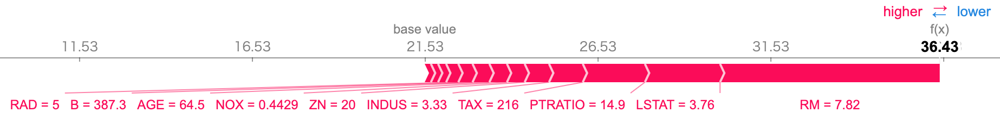

# ShapPack

ShapPack is a Python package for interpretable machine learning based on Shapley values.

ShapPack is currently in beta and under active development!

## Installation

```bash
$ pip install shappack
```

## Usage

```python
import shappack
import numpy as np
from sklearn.datasets import load_boston
from sklearn.model_selection import train_test_split
from sklearn.preprocessing import StandardScaler
from sklearn.svm import SVR
SEED = 123
np.random.seed(SEED)

# Prepare dataset
boston = load_boston()
X_train, X_test, y_train, y_test = train_test_split(boston["data"], boston["target"], test_size=0.2, random_state=SEED)
scaler = StandardScaler()
X_train_std = scaler.fit_transform(X_train)
X_test_std = scaler.transform(X_test)

# Prepare model
model = SVR(kernel="rbf")
model.fit(X_train_std, y_train)

# Coumpute SHAP value
i = 2
explainer = shappack.KernelExplainer(model.predict, X_train_std[:100])
shap_value = explainer.shap_values(X_test_std[i], n_workers=-1)
```

The usage of ShapPack is almost the same as that of [slundberg/shap](https://github.com/slundberg/shap).
An important difference is that `shap_values` function of ShapPack has an argument `n_workers`, which specifies the number of processes used to calculate the SHAP values.
This allows us to reduce the computation time of SHAP value when computing on multi-core servers.

For now, ShapPack does not have own visualization mechanism, so it is necessary to use [slundberg/shap](https://github.com/slundberg/shap) for visualization.

```python
import shap
shap.initjs()
shap.force_plot(explainer.base_val[0], shap_value, X_test[i], boston.feature_names)
```



## License

This project is licensed under the terms of the MIT license, see LICENSE.
